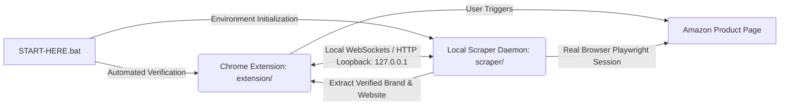

# 📦 Source Genius — Shareable Setup Package (v7.1.54)

<div align="center">

[](LICENSE)
[](https://github.com/Kamran5H/SourceGenius-Share)
[](https://github.com/Kamran5H/SourceGenius-Share)
[](https://github.com/Kamran5H/SourceGenius-Share)
[](https://github.com/Kamran5H/SourceGenius)

**The standalone, turnkey client deployment bundle of Source Genius for rapid workstation onboarding and automated configuration.**

[Overview](#-overview) • [Package Components](#-package-components) • [Turnkey Installation](#-step-by-step-onboarding) • [Troubleshooting](#-troubleshooting) • [License](#-license)

</div>

---

## 🌟 Overview

**SourceGenius-Share** is the zero-friction, redistributable workstation package of the [Source Genius](https://github.com/Kamran5H/SourceGenius) brand website discovery suite. Designed for swift onboarding of remote operators, team members, and clean Windows laptops, it packages both the **Manifest V3 Chrome Extension** and the **Autonomous Local Brand Reader** with a one-click automated setup script.

---

## 🧩 Package Components

This bundle couples two synchronized systems that operate in tandem:



1. **`extension/` (Chrome Manifest V3 Extension)**:
   - Provides the visual sidepanel UI inside Google Chrome.
   - Allows users to ingest ASINs, trigger brand extraction, and export leads.
2. **`scraper/` (Local Brand Reader Daemon)**:
   - Controls an anti-bot patched browser instance so Amazon serves unblocked product pages.
   - Without the scraper running, the extension UI functions, but product pages cannot be read.
3. **`START-HERE.bat` (Automated Bootstrap Script)**:
   - Automatically verifies Python installation, installs missing requirements, launches the local reader daemon, and guides the user to load the unpacked extension into Chrome.

---

## 📁 Repository Structure

```text
SourceGenius-Share/
├── START-HERE.bat              # One-click Windows turnkey launcher & health verifier
├── README.txt                  # Simple plain-text operator instructions
├── extension/                  # Complete Manifest V3 extension ready for Chrome
│   ├── manifest.json
│   ├── background.js
│   ├── sidepanel.html
│   └── sidepanel.js
├── scraper/                    # Local Python brand reader daemon & stealth drivers
│   ├── brand_reader.py
│   └── requirements.txt
├── .gitignore                  # Package and artifact exclusions
└── LICENSE                     # Open-source MIT License
```

---

## ⚡ Step-by-Step Onboarding

### 1. Initial Setup
1. Download or clone this repository to your target PC.
2. Double-click [`START-HERE.bat`](START-HERE.bat).
3. The script will automatically verify Python and start the local scraper worker.

### 2. Load Extension in Chrome
1. Open Google Chrome and visit `chrome://extensions/`.
2. Toggle on **Developer mode** in the upper-right corner.
3. Click **Load unpacked** and select the [`extension/`](extension/) directory from this folder.
4. Pin the **Source Genius** icon to your toolbar.

---

## 📜 License

This project is open-source and released under the [MIT License](LICENSE).  
Copyright (c) 2024-2026 **Kamran Ashraf**.
